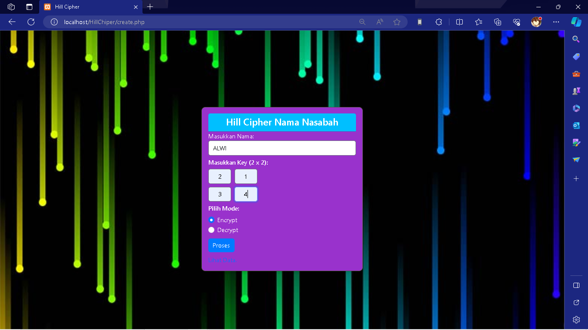
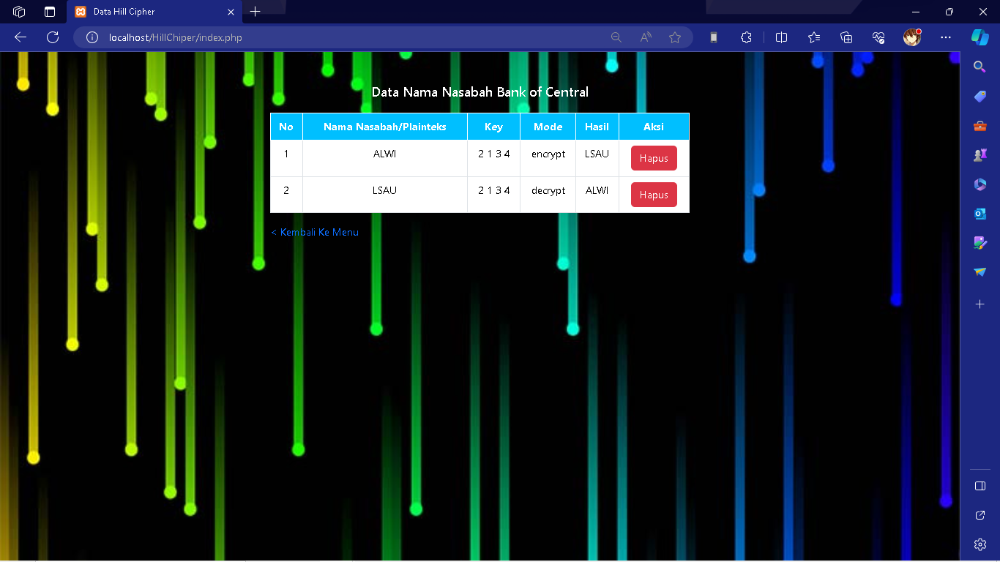

# Tugas Kriptografi
## Profil
| #               | Biodata                      |
| --------------- | ---------------------------- |
| **Nama**        | Muhammad Alwi Nur Fathihah   |
| **NIM**         | 312110388                    |
| **Kelas**       | TI.21.A.1                    |
| **Mata Kuliah** | Kriptografi                  |

## Hill Chiper

Hill Cipher adalah sebuah algoritma kriptografi kunci simetris yang menggunakan matriks sebagai kunci untuk mengenkripsi dan mendekripsi pesan. Algoritma ini dikembangkan oleh Lester S. Hill pada tahun 1929. Dalam metode ini, pesan dibagi menjadi blok-blok huruf yang kemudian diubah menjadi vektor. Matriks kunci digunakan untuk mengalikan vektor-vektor ini, menghasilkan ciphertext. Proses ini melibatkan konsep dasar matriks seperti perkalian antar matriks dan invers matriks. Keamanan Hill Cipher bergantung pada kerahasiaan matriks kunci yang digunakan, dan algoritma ini sering digunakan dalam kriptografi meskipun memiliki batasan keamanan tertentu.

### Cara Kerja

Cara kerja program ini secara detail adalah sebagai berikut:

1. **Input Pengguna**:
- Pengguna mengakses halaman `create.php` yang menampilkan formulir untuk memasukkan teks plainteks, matriks kunci (2x2), dan memilih mode enkripsi atau dekripsi (dengan mode diatur dalam radio button). Pengguna mengisi formulir ini dengan data yang ingin dienkripsi atau didekripsi.

2. **Pemrosesan Input di Server:**:
- Setelah pengguna mengisi formulir dan mengirimkannya, data yang dimasukkan diambil menggunakan metode POST di halaman `process.php`.

3. **Koneksi ke Database**:
- Halaman `process.php` menginisialisasi koneksi ke database MySQL. Informasi koneksi seperti nama host, nama pengguna, kata sandi, dan nama database didefinisikan di halaman ini.

4. **Fungsi Hill Cipher**:
- Fungsi Hill Cipher terdapat di `hillcipher.php`. Fungsi ini menerima teks plainteks, matriks kunci, dan mode (enksripsi atau dekripsi) sebagai parameter. Fungsi ini bekerja dengan langkah-langkah berikut:
   - Mengubah teks plainteks menjadi huruf kapital dan menghapus spasi (jika ada).
   - Memastikan panjang teks genap dengan menambahkan huruf "X" jika perlu.
   - Memproses teks plainteks per karakter atau per pasangan karakter, tergantung pada mode.
   - Menggunakan matriks kunci untuk melakukan operasi enkripsi atau dekripsi sesuai dengan aturan Hill Cipher.
   - Mengembalikan teks hasil enkripsi atau dekripsi.

5. **Penyimpanan Data**:
- Halaman `process.php` mengambil data hasil input pengguna, termasuk teks plainteks, matriks kunci, dan mode. Data ini kemudian diproses menggunakan fungsi Hill Cipher dari `hillcipher.php`.
- Hasil enkripsi atau dekripsi bersama dengan teks, kunci, dan mode disimpan ke dalam database MySQL menggunakan perintah SQL. Hasil ini akan digunakan untuk ditampilkan di halaman `index.php` dan dapat diakses kembali di masa mendatang.

6. **Tampilan Data**:
- Pengguna dapat melihat hasil enkripsi atau dekripsi yang telah disimpan dalam database dengan mengakses halaman `index.php`. Data ditampilkan dalam bentuk tabel yang mencakup teks, kunci, mode, dan hasil enkripsi atau dekripsi.

7. **Penghapusan Data**:
- Pengguna dapat menghapus data hasil enkripsi atau dekripsi tertentu dengan mengklik tautan hapus pada halaman `index.php`. Penghapusan data diimplementasikan di halaman `delete.php` dan menghapus data terkait dari database.

## Output

- Encrypt

- Decrypt

- Result

## Terima Kasih!